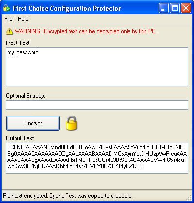

# Configuring fcSDK

## Basic fcSDK Configuration

### Application Configuration Settings

#### What is a .config file?

It is standard in .Net applications to use an application configuration file to provide a flexible and standardized location for configuration settings.

* Web Applications - there will be a **web.config** file present in the root directory of your web application.
* .exe - If your application is called *MyApp.exe* the configuration file would be called **MyApp.exe.config**

#### Configuring the fcSDK

Most of the configurable options for **fcSDK** are specified in the &lt;appSettings&gt; section of the config file. This is a simple key/value pair configuration section.

There is only one required but several optional appSettings keys that **fcSDK** can take advantage of.

At its most basic, your config file should look like:
```
<?xml version="1.0" encoding="utf-8" ?>
<configuration>
    <appSettings>
        <add
            key="fchoice.connectionstring"
            value="Data Source=server;Initial Catalog=database;uid=user;pwd=pass;" />
    </appSettings>
</configuration>
```

#### Compatibility Configuration

All application configuration settings can also be used when using [**fcSDK** Compatibility](compatibility-guide.md) which classically uses an fc.env file for configuration.

```
;begin fc.env file...
fchoice.connectionstring=Data Source=server;Initial Catalog=database;uid=user;pwd=pass;
```

### fcSDK Configuration Keys

| Key | Required | Default | Description |
|:--- |:--- |:--- |:--- |
| fchoice.cachefilepath | No | ".\fc_cache" | A full or relative file path which specifies the folder into which **fcSDK** should save it's cache files (if nocachefile is set to "false", otherwise this value is ignored). If the folder does not exist, it will be created.<br/>**NOTE:** The user under which the application is running must have the appropriate permissions to create and modify files in this folder and, if necessary, create the folder itself. |
| fchoice.connectionstring | <span style="color:red;">Yes</span> | N/A | An ADO.NET connection string to use with the specified DB type (or default if none is specified). The default provider is MSSQL and the connection string must be useable by the System.Data.SqlClient.SqlConnection class. Consult the [SqlConnection.ConnectionString property documentation](https://docs.microsoft.com/en-us/dotnet/api/system.data.sqlclient.sqlconnection.connectionstring?view=netframework-4.0) for specifics about what parameters are allowed in the connnection string. Please consult the documentation for other ADO.NET providers if you plan on using a different data provider type (like Oracle or Sybase). |
| fchoice.dbtype | No | "MSSQL" | Specifies the type of provider ClarifyApplication should to connect to the DB. Standard values are "MSSQL", "ORACLE", or "SYBASE". Other providers can be added, see the section on ["Custom Database Providers"](configuring-database-providers.md). |
| fchoice.disableloginfromfcapp | No | "true" | Specifies whether ClarifySession should allow sessions to be created without a username or password (similar to LoginFromFCApp in FCFL/COM). If this value is default, a call to create a session without any parameters will result in an exception being thrown. Administrators must knowingly enable this functionality after understanding the consequences of this action. |
| fchoice.enablebatch | No | "true" | Determines whether the current DB provider (specified by 'fchoice.dbtype' above) should batch SQL statements. This parameter is ignored if the provider cannot batch SQL statments in the first place (like Oracle, for example).<br/>**NOTE:** It is not recommended that this setting be changed unless you're having a specific problem with batching. |
| fchoice.logconfigfile | No | (not specified) | Specifies an external configuration file that LogManager should use to configure logging for this application. The config file will be monitored and changes to it will be reflected immediately in logging output of the application. See [Application Logging in the **fcSDK**](logging/application-logging.md) for more information on how to configure logging for **fcSDK**. |
| fchoice.nocachefile | No | "true" | Determines whether **fcSDK** creates cache files on disk after ClarifyApplication is initialized. If set to "true", the cache will be reloaded from the database every time the app is run or the web server restarted. Loading the cache from files is significantly faster than reloading from the database every app startup, however it needs to be manually updated after schema changes. |
| fchoice.perfcountersenabled | No | "false" | Allows disabling of performance counter functionality. If set to false First Choice applications will not interact with Windows performance monitoring capabilitites.<br/>**Note:** Please see the install guide for more information about security settings required for Performance Counters. |
| fchoice.perfmoninstancename | No | processname-processid | Specifies the name of the Performance Monitor instance to use when logging performance counters. This value shows up in Performance Monitor when adding counters under the "Instance" list. By default it is the name of the process (myapp.exe) followed by a hypen then the process id: myapp.exe-8124. |
| fchoice.sessionpasswordrequired | No | "true" | Specifies whether ClarifySession will allow passwordless logins. By default passwords are required and if a new ClarifySession is created without a password specified, an exception will be thrown. This setting is set default for security reasons. Administrators must knowingly enable it after understanding the consequences of this action. |
| fchoice.fcstringappnameforerrors | No | "fcSDK" | Specifies the application name to use when loading customized/localized error messages from the FC String table (table_fc_string). |
| fchoice.sqlbigquerytimethreshold | No | 0.0 | Specifies the minimum time (in seconds and fractions of seconds) a query must take before being considered a "Large Query". Large queries will be marked as such in the log file ("Large Query: True"). This allows filters to be placed on the log appender to log large query details to a separate appender. For more information on configuring logging to catch large queries, please see the [largesql_log.config example documentation](logging/large-queries.md). |
| fchoice.sqlbigquerycountthreshold | No | 0 | Specifies the minimum number of records a query must return before being considered a "Large Query". Large queries will be marked as such in the log file ("Large Query: True"). This allows filters to be placed on the log appender to log large query details to a separate appender. For more information on configuring logging to catch large queries, please see the [largesql_log.config example documentation](logging/large-queries.md). |
| fchoice.setstringparameterdbtypeandsize | No | "true" | Allows disabling of the type and size of SQL parameter being set by SDK. If set to "false", type and size of SQL parameter will be set by database driver.<br/>**Note:** This parameter is intended to allow the database driver defaults to be used in case of compatibility problems with older versions of database systems. |
| fchoice.dbprovider.configurationfile | No | N/A | Specifies an alternative xml configuration file for [Configuring Database Providers](configuring-database-providers.md). This is often used by ASP applications wishing to specify custom dbproviders but cannot easily use the normal application configuration file format. |
| fchoice.statemanager.configurationfile | No | N/A | Specifies an alternative xml configuration file for [Configuring Remote Sessions](remote-sessions.md). This is often used by ASP applications wishing to use Remote StateManagers but cannot easily use the normal application configuration file format. |
| fchoice.oracle.forceascii7bit | No | "true" | On Oracle 8.0.x and earlier databases, strings with non ascii or extended ascii charcters non ASCII strings would cause garbage data to be inserted into the database. This switch effectively removes Unicode support for strings on Oracle 8.0.x or earlier systems. |
| fchoice.clarify.convertcarriagereturns | No | "true" | To have the Clarify Windows client properly display multiline strings carriage return line feeds (CRLF) need to be converted to line feeds (LF) |
| fchoice.clarify.ignoredatetimemilliseconds | No | false | DateTime fields will not have millisecond resolution with this setting enabled. This setting is solely provided to maintain compatibility with Clarify Classic Client versions before 12.5 which did not save millisecond details. |

## Data Protection

Some configuration settings can contain sensitive information such as usernames and passwords. **fcSDK** can protect such sensitive settings in just two steps using **Data Protection**.

1. Encrypt the configuration parameter using the First Choice Configuration Protector Utility

   

2. Copy the encrypted parameter string into your .Net application's configuration file.
    ```
    <appSettings>
    <add key="fchoice.dbtype" value="MSSQL"/>
    <add key="fchoice.connectionstring" value="{encrypted text goes here}"/>
    </appSettings>
    ```

### Important!

The encrypted key can only be decrypted on the same machine from which it was encrypted on.
For example, if you want to use this encrypted key on your web server, then you should run the Configuration Protector application on your web server.

### Entropy
When you encrypt your parameter settings you can optionally specify an Entropy value which is used as a key to furthur secure the encrypted text.

#### fcSDK Users

If you use an Entropy value the FCConfiguration.DataProtectionEntropy property must match the Entropy key you used to encrypt your parameters.

[C#]
```csharp
FCConfiguration.DataProtectionsEntropy = "...Optional Key...";
ClarifyApplication.Initialize();
```

#### Compatibilty

If you use an Entropy value the FCApplication.DataProtectionEntropy property must match the Entropy key you used to encrypt your parameters.

[Javascript]
```
var FCApp = new ActiveXObject("FCFLCompat.FCApplication");
FCApp.DataProtectionsEntropy = "...Optional Key...";
FCApp.Initialize();
```
