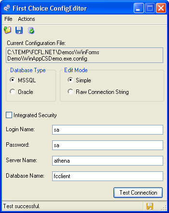

# Overview of the fcSDK Configuration Editor

The **fcSDK** ships with a Configuration Editor program to assist you in editing your **fcSDK** application XML configuration file.
Specifically, it allows you to set the fchoice.connectionstring and fchoice.dbtype keys in the appSettings section of the configuration.

For more information on the configuration file, and the key/value pairs, refer to [Application Configuration Settings](basic-configuration.md).

To run the Configuration Editor:

* Start the Configuration Editor application
* Use the *File - Open* menu to open an existing configuration file
* Choose an Edit Mode:
  * Simple - Enter the connection parameters and the Configuration Editor will build the Connection String for you
  * Raw - Allows you to manually edit the Connection String
* If using Edit Mode, fill in the connection parameters (DB Type, Login Name, Password, Server Name and Database Name)
* If using Raw Mode, edit the Connection String
		
* If you would like to use Integrated Security, click the Integrated Security checkbox
	* If unchecked, User ID and Password are specified in the connection string
	* If checked, the current Windows account credentials are used for authentication
* Click the Test Connection button to verify the connection information
* Use the *File - Save* menu to save the configuration file

