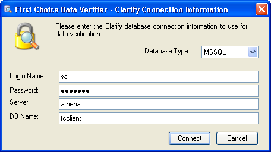
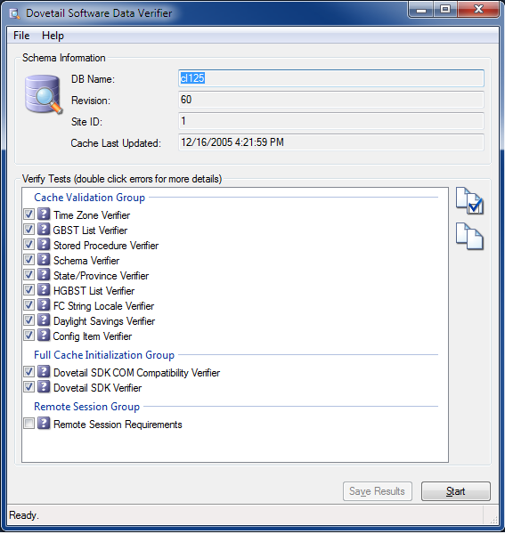
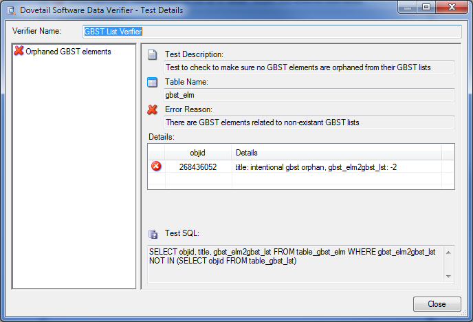
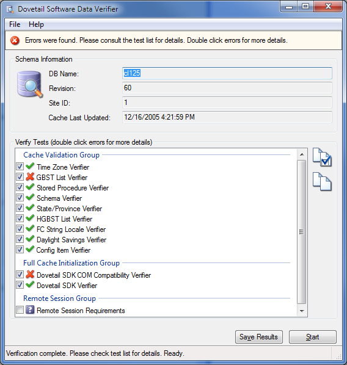

# Overview of the fcSDK Data Verifier

## The fcSDK Data Verifier

The **fcSDK** ships with a Data Verifier program that will validate the integrity of certain data in the database.

In order to prevent unexpected errors when using the **fcSDK**, it is best to verify the integrity of your data using the Data Verifier.

If any issues are found, it is recommended that you correct them before trying to use an **fcSDK** based application.

### Data Verifier:

* Verifies that the licensing schema is loaded in the database and that at least one license is present in the table
* Verifies that **FCFL.NET** can be initialized, create a new session, and log in
* Verifies that **FCFL.NET** can create a new generic and query data
* Tests to check to make sure no GBST or HGBST elements are orphaned from their lists
* Tests to make sure all HGBST elements have unique titles among their respective list levels
* Verifies that all table and view fields are properly related to a table or view *(EXC: Union Views have fields that are not related to tables or views. These are not reported as errors.)*
* Verifies that all relations are properly related to a table
* Tests to make sure all states/provinces are not orphaned from their countries
* Tests to check to make sure all countries are pointed to valid time zones
* And more!

### To run the Data Verifier:

* Start the Data Verifier application
* Fill in the login parameters and click the *Connect* button 
    
* Click the *Start* button 
    
* If any tests return an error, double-click the test for more details 
     
    
* If any issues are found, it is recommended that you correct them before trying to use an **fcSDK** based application
